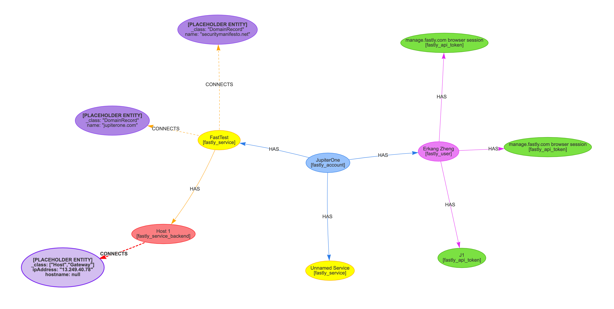

# JupiterOne Integration

## Development Environment

### Prerequisites

You must have Node.JS installed to run this project. If you don't already have
it installed, you can can download the installer
[here](https://nodejs.org/en/download/). You can alternatively install Node.JS
using a version manager like [fnm](https://github.com/Schniz/fnm) or
[nvm](https://github.com/nvm-sh/nvm).

### Setup

#### Installing dependencies

From the root of this project, run `npm install` to install dependencies. If you
have `yarn` installed, you can install dependencies by running `yarn`.

#### Loading credentials

Create a `.env` file at the root of this project and add environment variables
to match what is in `src/instanceConfigFields.ts`. The `.env` file is ignored by
git, so you won't have to worry about accidentally pushing credentials.

Given this example configuration:

```typescript
import { IntegrationInstanceConfigFieldMap } from '@jupiterone/integration-sdk-core';

const instanceConfigFields: IntegrationInstanceConfigFieldMap = {
  csutomerId: {
    type: 'string',
  },
  apiToken: {
    type: 'string',
    mask: true,
  },
};

export default instanceConfigFields;
```

You would provide a `.env` file like this:

```bash
CUSTOMER_ID="customer-id"
API_TOKEN="supersecret"
```

The snake cased environment variables will automatically be converted and
applied to the camel cased configuration field. So for example, `CUSTOMER_ID`
will apply to the `customerId` config field and `API_TOKEN` will apply to
`apiToken`.

## Running the integration

To start collecting data, run `yarn start` from the root of the project. This
will load in your configuration from `src/index.ts`.

To visualize the graph using locally collected data, run `yarn graph` from the
root of the project. Open `/.j1-integration/graph/index.html` in a browser. The
resulting graph should look like this:



## Documentation

### Development

Please reference the JupiterOne integration
[development documentation](https://github.com/JupiterOne/sdk/blob/master/docs/integrations/development.md)
for more information on how to use the SDK.

See [docs/development.md](docs/development.md) for details about how to get
started with developing this integration.

### Integration usage and resource coverage

More information about the resources covered by this integration and how to
setup the integration in JupiterOne can be found in
[docs/jupiterone.md](docs/jupiterone.md).

### Changelog

The history of this integration's development can be viewed at
[CHANGELOG.md](CHANGELOG.md).
